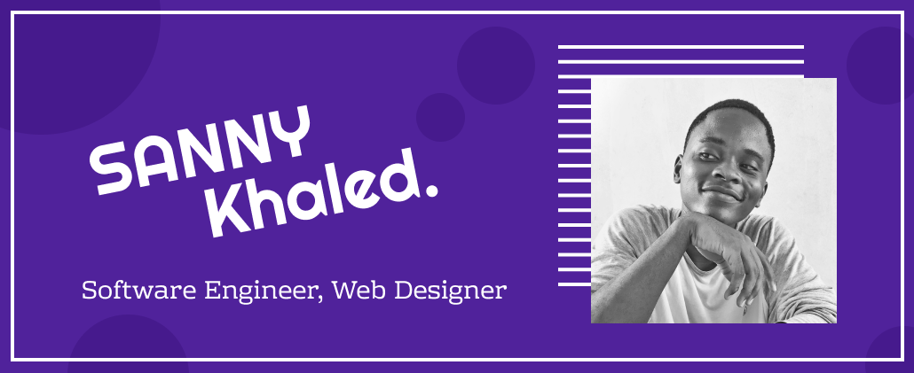

㊙️ yaHoo! 👋  Minasan 😉

 

### BASICALLY

- 🥸 20 y.o, studying **Software Engineering & Web Design**
- 🌱 I’m currently learning _typescript_, _threeJS_ and _canvas oriented implementation_
- 👯 I’m looking to collaborate on any Javascript Projects 😄
- 💬 Ask me about anything, really 😉 
- 📫 How to reach me: Use dark magic 😄... hum 🥸 ... you can find me on telegram 
- ⚡ Fun fact: I started coding in C++ with DevC++, omg  ... what was i thinking 
- ⚽ Hobbies: I like reading (so much), play videos games (NSUNS4), drawing (am a portraitist you know 😊)

#### Languages & Tools

  

 
    
